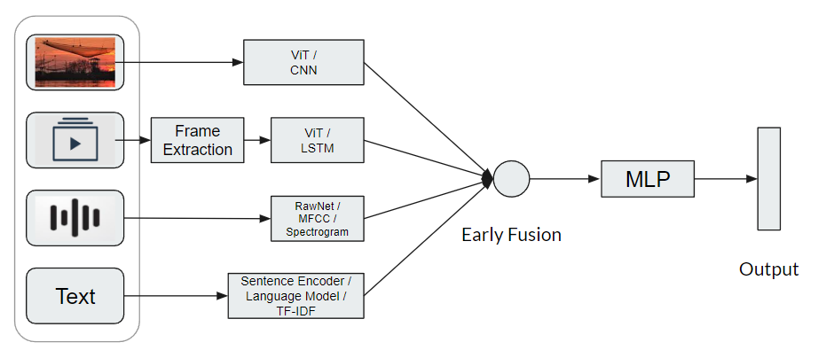

# Multi-Modal Social Media Posts Analysis

**Problem:** Let's say you are a Data Scientist working in a company that analyzes social media contents. Business team approached you and told you to build an Agent that will understand the context of a social media post that they will use to segment the content,find popularity,trends etc.

*Task*:
- Write down your approach to make the dataset, preprocess and train ML model to build
such an Intelligent Agent.
- Please note that a social media post could contain Texts, Images,Videos etc. And you
have to take all of this kind of data to a single Agent.
- You don't have to write any code. Just give us a detailed step by step description about
the process.

# Answer
Given the constraint that the social media posts may be contain different formats, I would approach the problem by leveraging **multi-modal learning**. To achieve this, I would follow the steps detailed below.

*Image 1: Demo pipeline using early fusion*

## 1. Literature Review and Prototyping
Before approaching the problem, my preliminary step would be to look for academic publications on existing or similar works. Then I would try to reproduce a few of the research works and create a prototype on a smaller scale to get an idea on the state of the art approaches. In this step I would also define my objective and modus operandi.

## 2. Dataset creation
### 2.1 Data Collection
|  |
|-------|
| Before going for the time and cost inducing methods, I would look for **existing social media datasets** on the internet. |
| After exhaustively looking for the publicly available datasets, I would look for **APIs provided by different social media websites** such as Facebook, Twitter, Reddit, Instagram, etc. |
| Finally, after merging the data retrieved by the two methods mentioned above, I would **scrape websites** that legally allow to do so. |
||

I recognize that further manual annotations might be needed depending on the specific tasks to solve.

### 2.2 Data Preprocessing
I would have to deploy different data preprocessing techniques for the different data formats.

*Text* data will have to normalized, stemmed and lemmatized before being tokenized based on a vocabulary. Existing  Word2Vec models or language models may be used to extract word or sentence embeddings.

*Image* data would be resized and normalized before passing them to pre-trained large CNN models to extract embeddings about them.

*Video* data has an extra temporal dimension in contrast to image data. Hence, after extracting the frames and preprocessing them, the frames will have to be passed into an RNN or LSTM model to extract a feature embedding of the video.

*Audio* data can be used to extract different features such as spectograms or MFCC. Some end to end deep learning approaches like the [RawNet](https://arxiv.org/abs/1904.08104) may also be explored.

### 2.3 Data Imbalance

Due to the multi modal nature of the data, it is expected that data across all formats will be imbalanced. This may negatively impact the performance of the models that use this dataset. I will experiment with several methods including *over/under sampling*, *cost-sensitive learning* and *knowledge distillation* to decelerate the effects of data imbalance.

## 3. Model Training

To create an agent that understands data of any format, I would first extract the feature embeddings from the input data as shown in (Image 1). Then I would finetune an `embedding model` for different tasks.

### 3.1 Content Segmentation Task

To segment the contents, I would first define the categories and add a fully connected layer to the MLP with node numbers equal to the category numbers. I would then take some annotated contents to train the MLP using the fused embedding.

### 3.2 Popularity Task

By aggregating different metrics such as likes, comments, shares, and views, I could attempt to create a popularity prediction model. This can be achieved by attaching a regressional layer to the MLP.

### 3.3 Trending Task

To find the trends, I would try to first categorize the contents in different topics and do sentiment-analysis on these topics. Finally I would apply time series analysis to plot the trends of the different topics based on the date the contents were posted.

### 3.4 Similarity task

To find if two contents are depicting the same real life event/emotion, the embeddings from the MLP can be used by finding their `cos_similarity` or other similar algorithms.

## 4 Discussion

The proposed methodology has many challenges that can only be verified and tackled through rigorous experimentations. One such problem may arise from missing modalities, which currently may be addressed by passing placeholder zero vectors. More solutions may be attempted based on [newer studies](https://arxiv.org/abs/2303.03369). In this answer, I have only discussed about early fusion, whereas other fusion strategies, such as intermediate fusion and late fusion may also be experimented with.