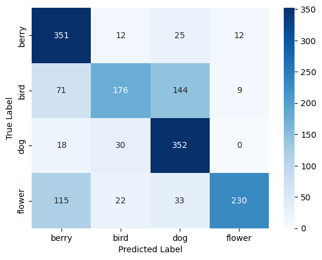
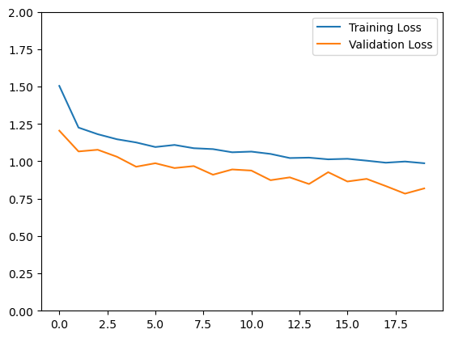
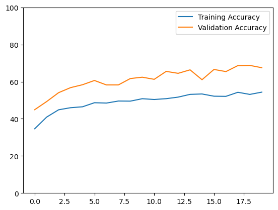
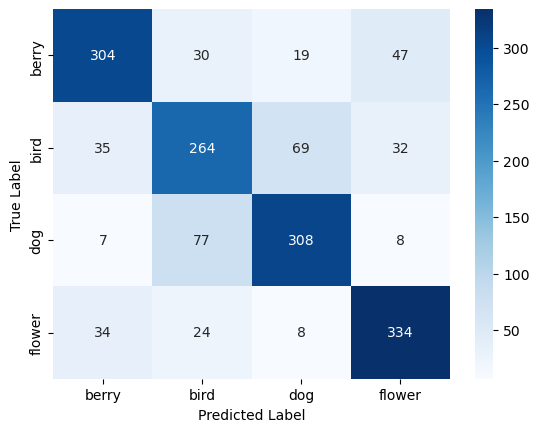
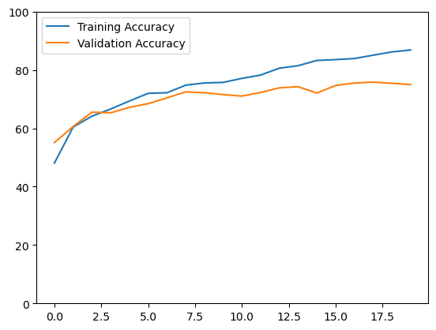

# Image Classification

# Tasks
## Preprocess the Data
Data preprocessing has been done in [train](train.py) file.

## Apply augmentation
Data augmentation has been done in [train](train.py) file.

## Build Classifier which will be able to classify the input photo to one of the 4 classes
[Conv2Model](model.py) has been created and [trained](main.ipynb) for 20 epochs.

## Plot matrices

F1-Score: 0.693125

## Prove that your model is not overfitted

From the above plots, we observe that the validation scores (both loss and accuracy) are slightly better than the training scores. **Because of this, we can claim that it is more plausible that the model is not overfitted.**

## Build one more classifier and apply any kind of ensemble techniques.
An [EnsembleModel](model.py) consisting of [Conv2Model](model.py) and [Conv3Model](model.py) has been created and [trained](main.ipynb) for 20 epochs.

**F1-Score: 0.75625**

